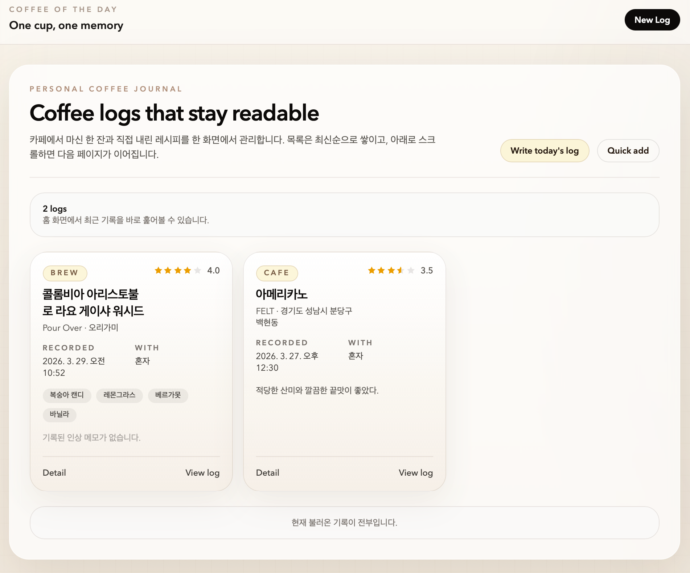
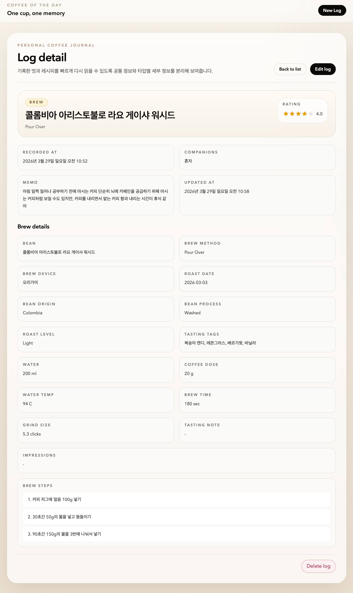
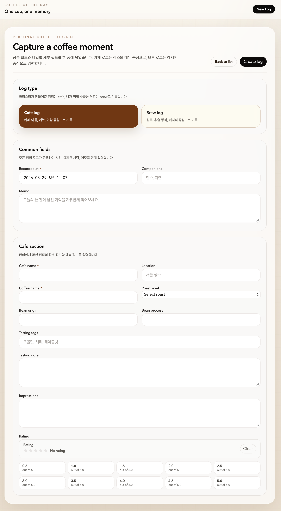

# Coffee of the Day

**Coffee of the Day**는 오늘 마신 커피를 기록하는 개인용 로그 애플리케이션입니다.  
카페에서 마신 커피와 직접 추출한 커피를 구분해서 남길 수 있고, 맛, 분위기, 추출 정보처럼 다시 돌아봤을 때 의미 있는 내용을 간단하게 정리하는 데 초점을 두고 있습니다.

이 프로젝트는 **직접 개발 없이 AI만 사용해 만든 애플리케이션**입니다.  
사람은 요구사항을 정리하고 결과를 검수하는 역할을 맡았고, 구현, 테스트, 문서화는 AI 에이전트를 중심으로 진행했습니다.

## 소개

커피 기록 앱은 흔하지만, 실제로는 "무엇을 어떻게 남길지"가 애매해서 금방 쓰지 않게 되는 경우가 많습니다.  
이 프로젝트는 그 지점을 단순하게 풀어보려는 시도에서 시작했습니다.

- 바리스타가 만들어준 커피는 `cafe` 로그로 기록
- 직접 내린 커피는 `brew` 로그로 기록
- 공통 정보와 타입별 정보를 한 번에 정리
- 나중에 다시 읽었을 때 이해하기 쉬운 형태로 저장

즉, 짧은 감상만 남기는 메모 앱보다는 조금 더 구조적이고, 복잡한 커피 데이터 관리 서비스보다는 가벼운 기록 도구에 가깝습니다.

## 주요 기능

- 카페 로그 생성, 조회, 수정, 삭제
- 브루 로그 생성, 조회, 수정, 삭제
- 날짜, 동행인, 메모 등 공통 정보 기록
- 카페 이름, 메뉴, 원두 정보, 테이스팅 태그, 평점 기록
- 추출 방식, 도구, 원두량, 물량, 온도, 시간, 추출 단계 기록
- 메인 화면에서 최신순 목록 확인
- 상세 화면에서 기록 내용 다시 보기

## 현재 범위

현재 저장소는 **Phase 1 기준의 기본 기록 흐름**까지 구현되어 있습니다.

- 홈 화면에서 로그 목록 확인
- 신규 로그 작성
- 기존 로그 상세 조회
- 수정 및 삭제

인증 기능은 아직 포함되어 있지 않으며, 로컬 개발 단계에서는 POC 방식으로 동작합니다.

## 실행 방법

### 백엔드

```bash
cd backend
go run ./cmd/server
```

기본 주소: `http://localhost:8080`

### 프론트엔드

```bash
cd frontend
npm install
npm run dev
```

기본 주소: `http://localhost:5173`

프론트엔드는 기본적으로 `http://localhost:8080/api/v1` 백엔드를 사용하도록 설정되어 있습니다.

## 화면 예시

### 메인 화면

기록된 커피 로그를 카드 형태로 확인할 수 있습니다.

<p align="center">
  
</p>

### 상세 화면

기록 하나를 열어 공통 정보와 카페/브루 전용 정보를 자세히 볼 수 있습니다.

<p align="center">
  
</p>

### 기록 작성 화면

카페 로그와 브루 로그를 한 폼 안에서 입력할 수 있습니다.

<p align="center">
  
</p>

## AI로 만든 프로젝트라는 점에 대해

이 프로젝트는 AI를 보조 도구로만 사용한 것이 아니라, 실제 구현 과정을 AI 중심으로 진행한 사례입니다.  
기능 구현, 테스트 코드 작성, 문서 정리까지 AI가 이어서 수행하고, 사람은 방향을 제시하고 결과를 검토하는 방식으로 개발했습니다.

그래서 이 저장소는 하나의 커피 기록 앱이면서 동시에, **AI만으로 어디까지 일관된 애플리케이션 개발이 가능한지 살펴보는 실험 기록**이기도 합니다.

## 저장소 안내

- [`spec.md`](./spec.md): 기능 명세
- [`plan.md`](./plan.md): 단계별 개발 계획
- [`tasks.md`](./tasks.md): 구현 체크리스트
- [`guide/`](./guide): 단계별 학습 문서와 아키텍처 문서

---

이 문서는 Claude Code와 Codex가 작성했습니다.
